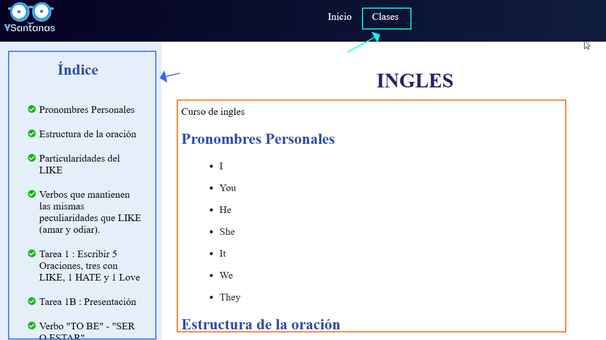

# Bienvenido al Curso de Inglés
Este contenido mostrará lo relevante al nivel básico de Inglés.

## ¿Cómo funciona?
El manejo es sencillo, solo necesitamos dirigirnos al apartado de clases, en donde se encuentra ordenado lo que concierne al curso impartido.

       

Como podemos observar en la imagen anterior, en la parte lateral izquierda tenemos el indice del contenido de cada clase, mientras en que en la derecha tendremos los apuntes de dicha clase, ademas de esto, se señala tambien la forma de navegar por el contenido.        

